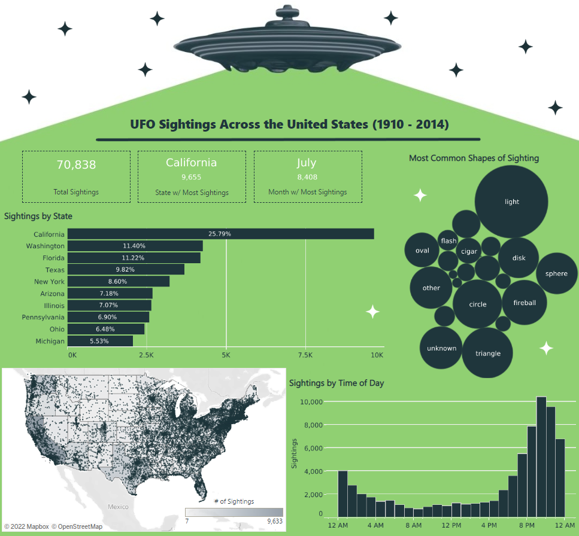

# Maven-UFO-Sightings

This project explores the Space Missions dataset from Maven Analytic’s [Data Playground](https://www.mavenanalytics.io/data-playground). Although I may not believe in UFOs as they are commonly displayed in the media, I still thought this would be interesting to explore! 

The dataset consists of 80,000+ rows of records each representing a UFO sighting from 1909 to 2014 and containing information about the city, state, country, coordinates, shape, duration, etc. For this project, I used Python to clean and transform the data (`UFO Sightings Analysis.ipynb`). Then used Tableau to visualize. 

**Some (but not all) questions I used during my analysis included:**
- Which states/months/time periods had the most sightings? 
- What was the typical duration of a sighting?
- Which words occurred most in the sighting’s comments?

The `ufo_sightings_scrubbed.csv` file contains the data as provided by Maven Analytics. While the `ufo_sightings_clean.csv` file is the same data after cleaning and transforming in preparation for visualizing. Some differences in the data include:
- Cleaned and converted `duration_(seconds)` to minutes
- Parsed `datetime` into individual columns for the date, year, month
- Created new columns to include the full month and state (rather than abbreviated) 
- Removed HTML code characters

**Tableau Viz:** https://public.tableau.com/views/UFOSightings_16689701565220/Dashboard1?:language=en-US&publish=yes&:display_count=n&:origin=viz_share_link

**Packages Used:**
- pandas
- numpy
- matplotlib
- counter
